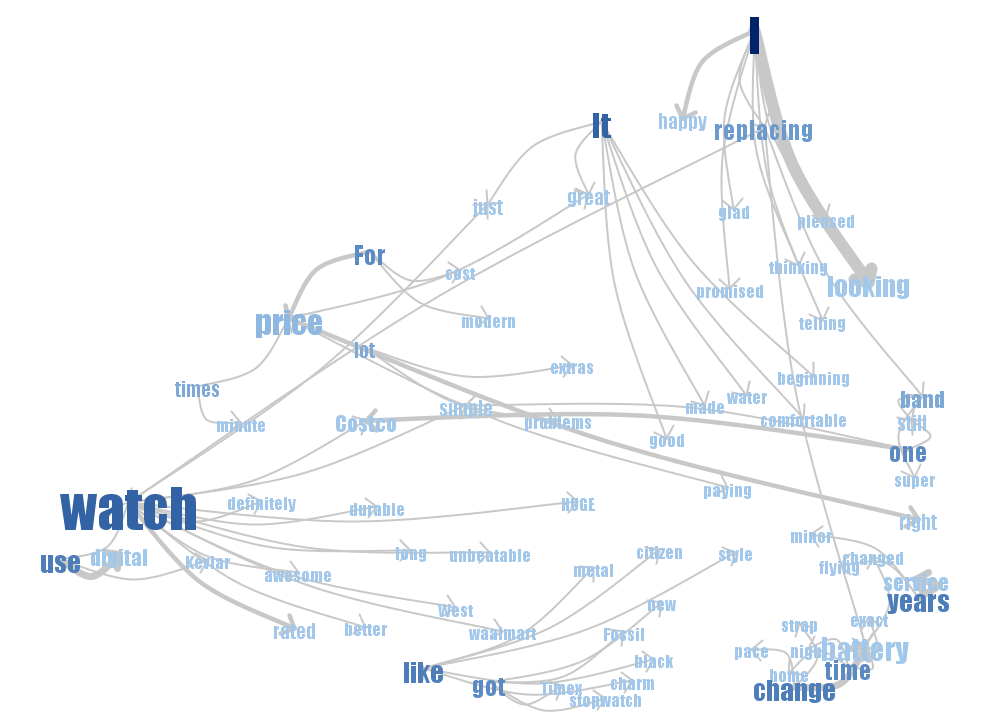
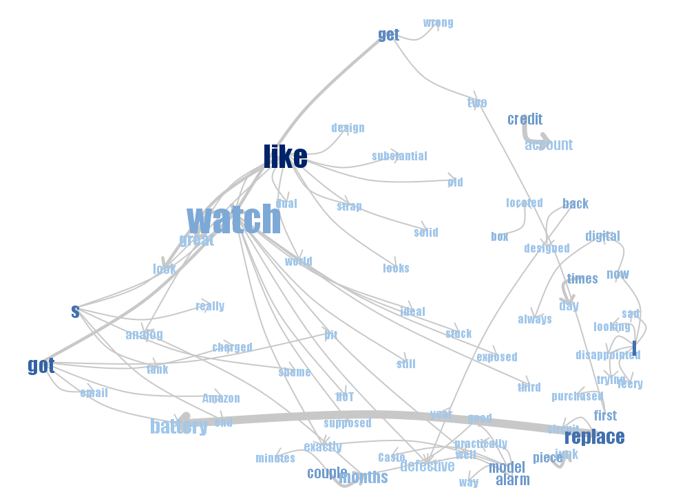
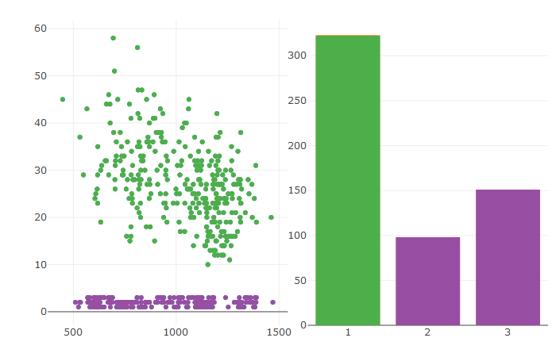
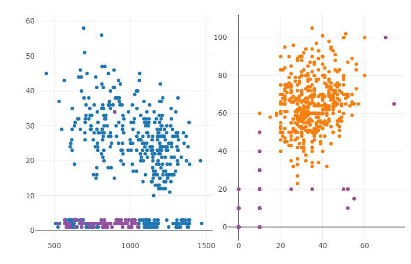

```{r libraries, message=FALSE, warning=FALSE, echo=FALSE}
library(ggplot2)
library(plotly)
library(tm)
library(wordcloud)
library(RColorBrewer)
library(crosstalk)
library(GGally)
library(htmltools)
library(tidyr)
```

## Assignment 1

### 1.1 Word Clouds

```{r echo=FALSE}
df1<-read.table("OneTwo.txt",header=F, sep='\n') #Read file
df2<-read.table("Five.txt",header=F, sep='\n')
```

Word cloud for Five.txt
```{r}
# wordcloud for Five.txt

df2$doc_id=1:nrow(df2)
colnames(df2)[1]<-"text"

#Here we interpret each line in the document as separate document
mycorpus <- Corpus(DataframeSource(df2)) #Creating corpus (collection of text data)
mycorpus <- tm_map(mycorpus, removePunctuation)
mycorpus <- tm_map(mycorpus, function(x) removeWords(x, stopwords("english")))
tdm <- TermDocumentMatrix(mycorpus) #Creating term-document matrix
m <- as.matrix(tdm)

#here we merge all rows
v <- sort(rowSums(m),decreasing=TRUE) #Sum up the frequencies of each word
d <- data.frame(word = names(v),freq=v) #Create one column=names, second=frequences
pal <- brewer.pal(5,"Dark2")
pal <- pal[-(1:2)] #Create palette of colors
wordcloud(d$word,d$freq, scale=c(8,.3),min.freq=2,max.words=100, random.order=F, rot.per=.15, colors=pal)
title(main = "Word Cloud for Five.txt", font.main=1.5)
```

It seems the word "watch" appears frequently, as this word seems quite larger than others. There seems some properties of watch like price, band, looks, durable, battery, dial. These words refers that the customers who bought this watch are well satisfied.

Word cloud for OneTwo.txt
```{r}
# word cloud for OneTwo.txt
df1$doc_id=1:nrow(df1)
colnames(df1)[1]<-"text"

#Here we interpret each line in the document as separate document
mycorpus <- Corpus(DataframeSource(df1)) #Creating corpus (collection of text data)
mycorpus <- tm_map(mycorpus, removePunctuation)
mycorpus <- tm_map(mycorpus, function(x) removeWords(x, stopwords("english")))
tdm <- TermDocumentMatrix(mycorpus) #Creating term-document matrix
m <- as.matrix(tdm)

#here we merge all rows
v <- sort(rowSums(m),decreasing=TRUE) #Sum up the frequencies of each word
d <- data.frame(word = names(v),freq=v) #Create one column=names, second=frequences
pal <- brewer.pal(8,"Dark2")
#pal <- pal[-(1:2)] #Create palette of colors
wordcloud(d$word,d$freq, scale=c(8,.3),min.freq=3,max.words=100, random.order=F, rot.per=.15, colors=pal)
title(main = "Word Cloud for OneTwo.txt", font.main=1)
```

The customers bought the casio watch in amazon. Again the word "watch" appears larger than others. The words like stopped, replacement, sent, back, quit, problem, alarm, died, defective states that the customers are not really satisfied with this purchase. They tend to return it back as it has many defects.


### 1.2 Phrase nets with connector words







### 1.3 Word Trees


#### Analysis:

* The properties such as lighted dial, stylish classic look, price, digital display, battery function, alarm are mentioned often in the text.

* The satisfied customers of CASIO watch who bought the watches from Amazon conveys that the watch don't stop, it is best looking, durable, worry free, does not scratch easily, robust, awesome watch for money, rugged watch and comfortable resin band, casual and sport, analog watch and digital. The customers are really happy as their expectations fulfilled as the watch works with greater accuracy and it is water resistant too. The shipping is quite fast. So, the customers are really very satisfied with these properties and they tend to buy again for this cheap price.

* The unsatisfied customers of CASIO watch says like there was very poor luminosity in Casio dive watch and they find difficulty in reading time at night time. The button often quit working. Some more problems like the cheap rubber band, problem in analog function, replacing battery often as it quit less than 12 months and it just quit working, and always just after the warranty expired, getting stuck in alarm mode cause the customers not to buy that watch again. 

* Properties mentioned by both groups
    + Good properties: solar power, stylish classic look, digital display, price, lighted dial 
    + Bad properties: poor luminosity, cheap rubber band, battery function, alarm, analog function 
        


* When we enter the words and see the graph, the details are not clear enough. The words are randomly displayed in a tree. Once some specific word is choosen from the text besides the tree, the word tree displays words related to that specific word choosen. For example, when we choose "Super" word from the text, the words such as durable and worry free, nice luminescent hands, quality watch, does not scratch easily, stylish watch, fast shipping get displayed. When we search by choosing certain words, we can understand the watch characteristics by observing the word trees.


## Assignment 2

```{r data, echo = TRUE}
# Olive data
olive <- read.csv("olive.csv", sep = ",", header = TRUE)

# convert region to factor
olive$Region <-as.factor(olive$Region)
```

```{r shared}
olive_shared <- SharedData$new(olive)
```


### 2.1

```{r scatterplot, message=FALSE, warning=FALSE, paged.print=FALSE}
eic_lin_scatt <- olive_shared %>% 
  plot_ly(x = ~linoleic, y =~ eicosenoic) #%>%
  
  #add_markers(list(size = 6, color = "orange"))
```

We found, for unusually low observations of Eicosenoic it takes the values of 1,2,and 3.

### 2.2
Using persistent brushing we identified regions 2 and 3 as the corresponding regions to the low values of eicosenoic.
Interacting with the slider we can observe the relationship of Eicosenoic and Linoleic and their distribution in the various regions with respect to the range of Stearic variable. Thus, for different ranges of Stearic, the distribution between Eicosenoic and Linoleic changes as well as regions distributions.

Interaction operators used in this exercise were:

* Filtering operators: This operator reduce the amount of data to be visualized, therefore by using the slider to select the range of Stearic, the data to be visualized is reduced.

* Selection operators: This is used to isolate or subset data that need further visualization techniques applied. Hold and dragging the mouse to select the low values of Eicosenoic isolates this set for persistent brushing to identify the regions they belong to.

* Connection operators: Linking the different plots to each other such that selection in one plot influences the next plot. In this exercise the scatter plot of Eicosenoic vs Linoleic and the bar graph of Regions are linked.

```{r barchart}
bar_chart <- olive_shared %>%
  plot_ly( x =~ Region) %>%
  add_histogram() %>%
  layout(barmode = "overlay"
  )

```


```{r link, message=FALSE, warning=FALSE, paged.print=FALSE}
# linking the scatterplot and bar chart
#subplot(eic_lin_scatt, bar_chart) %>%
 # highlight(on = "plotly_select", dynamic = T, persistent = T, opacityDim = I(1)) %>%
#  hide_legend()

bscols(widths=c(2, NA),filter_slider("S", "Stearic", olive_shared, ~stearic)
        ,subplot(eic_lin_scatt, bar_chart)%>%
  highlight(on="plotly_select", dynamic=T, persistent = T, opacityDim = I(1))%>%hide_legend())
```


```{r brushed, fig.cap = "Persistent Brushing on outliers"}

```

### 2.3
Oultiers in (arachidic, linolenic) are not ordered in the same way as in (eicosenoic, linoleic). The png file attached demonstrates which outliers are common in both scatter plots. Linoleic with values less than 20 and higher than 60 are outliers in both plots with the exception of 1.

```{r message=FALSE, warning=FALSE, paged.print=FALSE}
ara_lin_scatt <- olive_shared %>% 
  plot_ly(x = ~linolenic, y =~ arachidic)

subplot(eic_lin_scatt, ara_lin_scatt) %>%
  highlight(on = "plotly_select", dynamic = T, persistent = T, opacityDim = I(1)) %>%
  hide_legend()
```

```{r brushed2, fig.cap = "Outliers"}

```


### 2.4

```{r parcoord}
# the eight acids (column 4:11)
parcord <- ggparcoord(olive, columns = c(3:10))
```

```{r plotlydata}
# plotly_data returns data associated with a plotly visualization.
p_data <- plotly_data(ggplotly(parcord)) %>% group_by(.ID)
```

```{r shared1, echo=FALSE}
# data for crosstalk
shared1<-SharedData$new(p_data, ~.ID, group = "Olive")
```

```{r parcords}
par_plot <- plot_ly(shared1, x = ~variable, y =~value) %>%
  add_lines(line = list(width = 0.3)) %>%
  add_markers(marker = list(size = 0.3),
              text = ~.ID, hoverinfo = "text") 

```

```{r allshared, echo = FALSE}
# subset
olive2 <- olive

# create an id
olive2$.ID <- 1:nrow(olive)

# shared data 2
shared2 <- SharedData$new(olive2, ~.ID, group = "olive")
```

```{r region, echo=FALSE}
# bar graph of region
region_bar <- shared2 %>%
  plot_ly( x =~ Region) %>%
  add_histogram() %>%
  layout(barmode = "overlay")

```


```{r brushing0, message=FALSE, warning=FALSE, paged.print=FALSE}
bscols(par_plot%>%highlight(on="plotly_select", dynamic=T, persistent = T, opacityDim = I(1))%>%
         hide_legend(),
       region_bar%>%highlight(on="plotly_click", dynamic=T, persistent = T)%>%hide_legend())
```


```{r brushing1, eval=FALSE, message=FALSE, warning=FALSE, paged.print=FALSE}
ps<-htmltools::tagList(par_plot%>%
  highlight(on="plotly_select", dynamic=T, persistent = T, opacityDim = I(1))%>%
  hide_legend(),
  region_bar%>%
    highlight(on="plotly_click", dynamic=T, persistent = T, opacityDim = I(1))%>%
    hide_legend()
  )
htmltools::browsable(ps)
```


```{r brushing2, message=FALSE, warning=FALSE, paged.print=FALSE, eval=FALSE}
# ignore this
subplot(par_plot, region_bar, nrows =2) %>%
  highlight(on="plotly_select", dynamic=T, persistent = T, opacityDim = I(1))%>%
  hide_legend()
```

```{r 3dplot, echo=FALSE, message=FALSE, warning=FALSE, paged.print=FALSE}
# variable selection
ButtonsX=list()
for (i in 4:8){
  ButtonsX[[i-3]]= list(method = "restyle",
                        args = list( "x", list(olive2[[i]])),
                        label = colnames(olive2)[i])
}

ButtonsY=list()
for (i in 4:8){
  ButtonsY[[i-3]]= list(method = "restyle",
                        args = list( "y", list(olive2[[i]])),
                        label = colnames(olive2)[i])
}

ButtonsZ=list()
for (i in 4:8){
  ButtonsZ[[i-3]]= list(method = "restyle",
                        args = list( "z", list(olive2[[i]])),
                        label = colnames(olive2)[i])
}

plot3d <- plot_ly(shared2,x=~oleic, y=~linolenic, z=~palmitic)%>%
  add_markers() %>%
  layout(xaxis=list(title=""), yaxis=list(title="", zaxis =list(titles="")),
    title = "3d Scatter plot",
    updatemenus = list(
      list(x=0.07, y=0.6, buttons = ButtonsX, showactive = TRUE, method = "update" ),
      list(x =0.07, y=0.7, buttons = ButtonsY, showactive = TRUE, method = "update" ),
      list(x =0.07, y= .8, buttons = ButtonsZ, showactive = TRUE, method = "update" )
    ),
    annotations = list(
      list(text = "X", x= 0, y = 0.6, showarrow = FALSE),
      list(text = "Y", x = 0, y = 0.7, showarrow = FALSE),
      list(text = "Z", x = 0, y = .8, showarrow = FALSE)
    )
  
  )

plot3d
```


### Appendix

```{r ref.label=knitr::all_labels(), echo = T, eval = F}

```

### References