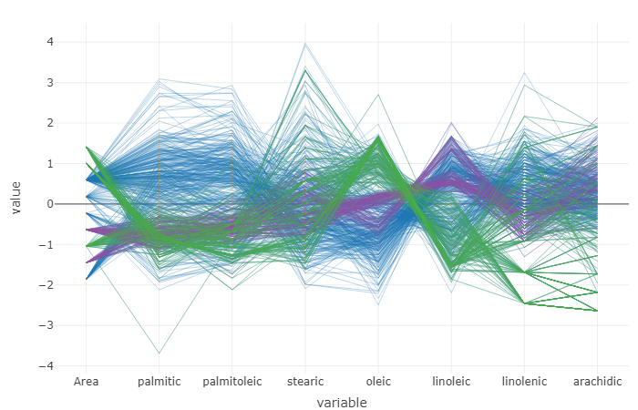
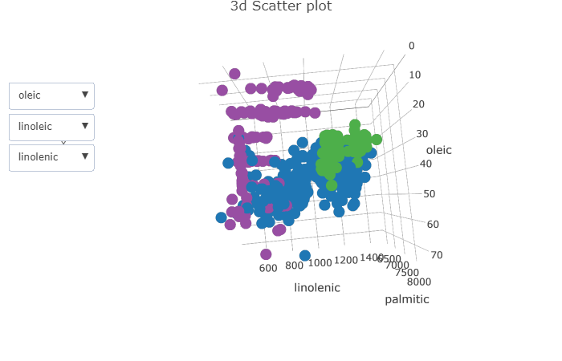

```{r libraries, message=FALSE, warning=FALSE, echo=FALSE}
library(ggplot2)
library(plotly)
library(tm)
library(wordcloud)
library(RColorBrewer)
library(crosstalk)
library(GGally)
library(htmltools)
library(tidyr)
```

## Assignment 1

### 1.1 Word Clouds

```{r echo=FALSE}
df1<-read.table("OneTwo.txt",header=F, sep='\n') #Read file
df2<-read.table("Five.txt",header=F, sep='\n')
```

Word cloud for Five.txt
```{r}
# wordcloud for Five.txt

df2$doc_id=1:nrow(df2)
colnames(df2)[1]<-"text"

#Here we interpret each line in the document as separate document
mycorpus <- Corpus(DataframeSource(df2)) #Creating corpus (collection of text data)
mycorpus <- tm_map(mycorpus, removePunctuation)
mycorpus <- tm_map(mycorpus, function(x) removeWords(x, stopwords("english")))
tdm <- TermDocumentMatrix(mycorpus) #Creating term-document matrix
m <- as.matrix(tdm)

#here we merge all rows
v <- sort(rowSums(m),decreasing=TRUE) #Sum up the frequencies of each word
d <- data.frame(word = names(v),freq=v) #Create one column=names, second=frequences
pal <- brewer.pal(5,"Dark2")
pal <- pal[-(1:2)] #Create palette of colors
wordcloud(d$word,d$freq, scale=c(8,.3),min.freq=2,max.words=100, random.order=F, rot.per=.15, colors=pal)
title(main = "Word Cloud for Five.txt", font.main=1.5)
```

It seems the word "watch" appears frequently, as this word seems quite larger than others. There seems some properties of watch like price, band, looks, durable, battery, dial. These words refers that the customers who bought this watch are well satisfied.

Word cloud for OneTwo.txt
```{r}
# word cloud for OneTwo.txt
df1$doc_id=1:nrow(df1)
colnames(df1)[1]<-"text"

#Here we interpret each line in the document as separate document
mycorpus <- Corpus(DataframeSource(df1)) #Creating corpus (collection of text data)
mycorpus <- tm_map(mycorpus, removePunctuation)
mycorpus <- tm_map(mycorpus, function(x) removeWords(x, stopwords("english")))
tdm <- TermDocumentMatrix(mycorpus) #Creating term-document matrix
m <- as.matrix(tdm)

#here we merge all rows
v <- sort(rowSums(m),decreasing=TRUE) #Sum up the frequencies of each word
d <- data.frame(word = names(v),freq=v) #Create one column=names, second=frequences
pal <- brewer.pal(8,"Dark2")
#pal <- pal[-(1:2)] #Create palette of colors
wordcloud(d$word,d$freq, scale=c(8,.3),min.freq=3,max.words=100, random.order=F, rot.per=.15, colors=pal)
title(main = "Word Cloud for OneTwo.txt", font.main=1)
```

The customers bought the casio watch in amazon. Again the word "watch" appears larger than others. The words like stopped, replacement, sent, back, quit, problem, alarm, died, defective states that the customers are not really satisfied with this purchase. They tend to return it back as it has many defects.


### 1.2 Phrase nets with connector words


### 1.3 Word Trees


#### Analysis:

* The properties such as lighted dial, stylish classic look, price, digital display, battery function, alarm are mentioned often in the text.

* The satisfied customers of CASIO watch who bought the watches from Amazon conveys that the watch don't stop, it is best looking, durable, worry free, does not scratch easily, robust, awesome watch for money, rugged watch and comfortable resin band, casual and sport, analog watch and digital. The customers are really happy as their expectations fulfilled as the watch works with greater accuracy and it is water resistant too. The shipping is quite fast. So, the customers are really very satisfied with these properties and they tend to buy again for this cheap price.

* The unsatisfied customers of CASIO watch says like there was very poor luminosity in Casio dive watch and they find difficulty in reading time at night time. The button often quit working. Some more problems like the cheap rubber band, problem in analog function, replacing battery often as it quit less than 12 months and it just quit working, and always just after the warranty expired, getting stuck in alarm mode cause the customers not to buy that watch again. 

* Properties mentioned by both groups
    + Good properties: solar power, stylish classic look, digital display, price, lighted dial 
    + Bad properties: poor luminosity, cheap rubber band, battery function, alarm, analog function 
        


* When we enter the words and see the graph, the details are not clear enough. The words are randomly displayed in a tree. Once some specific word is choosen from the text besides the tree, the word tree displays words related to that specific word choosen. For example, when we choose "Super" word from the text, the words such as durable and worry free, nice luminescent hands, quality watch, does not scratch easily, stylish watch, fast shipping get displayed. When we search by choosing certain words, we can understand the watch characteristics by observing the word trees.


## Assignment 2

```{r data, echo = TRUE}
# Olive data
olive <- read.csv("olive.csv", sep = ",", header = TRUE)

# convert region to factor
olive$Region <-as.factor(olive$Region)
```

```{r shared}
olive_shared <- SharedData$new(olive)
```


### 2.1

```{r scatterplot, message=FALSE, warning=FALSE, paged.print=FALSE}
eic_lin_scatt <- olive_shared %>% 
  plot_ly(x = ~linoleic, y =~ eicosenoic) #%>%
  
  #add_markers(list(size = 6, color = "orange"))
```

We found, for unusually low observations of Eicosenoic it takes the values of 1,2,and 3.

### 2.2
Using persistent brushing we identified regions 2 and 3 as the corresponding regions to the low values of eicosenoic.
Interacting with the slider we can observe the relationship of Eicosenoic and Linoleic and their distribution in the various regions with respect to the range of Stearic variable. Thus, for different ranges of Stearic, the distribution between Eicosenoic and Linoleic changes as well as regions distributions.

Interaction operators used in this exercise were:

* Filtering operators: This operator reduce the amount of data to be visualized, therefore by using the slider to select the range of Stearic, the data to be visualized is reduced.

* Selection operators: This is used to isolate or subset data that need further visualization techniques applied. Hold and dragging the mouse to select the low values of Eicosenoic isolates this set for persistent brushing to identify the regions they belong to.

* Connection operators: Linking the different plots to each other such that selection in one plot influences the next plot. In this exercise the scatter plot of Eicosenoic vs Linoleic and the bar graph of Regions are linked.

```{r barchart}
bar_chart <- olive_shared %>%
  plot_ly( x =~ Region) %>%
  add_histogram() %>%
  layout(barmode = "overlay"
  )

```


```{r link, message=FALSE, warning=FALSE, paged.print=FALSE}
# linking the scatterplot and bar chart
#subplot(eic_lin_scatt, bar_chart) %>%
 # highlight(on = "plotly_select", dynamic = T, persistent = T, opacityDim = I(1)) %>%
#  hide_legend()

bscols(widths=c(2, NA),filter_slider("S", "Stearic", olive_shared, ~stearic)
        ,subplot(eic_lin_scatt, bar_chart)%>%
  highlight(on="plotly_select", dynamic=T, persistent = T, opacityDim = I(1))%>%hide_legend())
```


```{r brushed, fig.cap = "Persistent Brushing on outliers", fig.align = "center", fig.width = 12, fig.height = 12}

```

### 2.3
Oultiers in (arachidic, linolenic) are not ordered in the same way as in (eicosenoic, linoleic). The png file attached demonstrates which outliers are common in both scatter plots. Linoleic with values less than 20 and higher than 60 are outliers in both plots with the exception of 1.

```{r message=FALSE, warning=FALSE, paged.print=FALSE}
ara_lin_scatt <- olive_shared %>% 
  plot_ly(x = ~linolenic, y =~ arachidic)

subplot(eic_lin_scatt, ara_lin_scatt) %>%
  highlight(on = "plotly_select", dynamic = T, persistent = T, opacityDim = I(1)) %>%
  hide_legend()
```

```{r brushed2, fig.cap = "Outliers", fig.align = "center", fig.width = 12, fig.height = 12}

```


### 2.4
We found the three influential variables to be **Oleic**, **Linoleic**, and **linolenic**. This is because of the parallel lines are closer for individual regions at each of the variables. This indicates also indicates strong association. Moreover, there is a unique pattern which is observable when the PCP is colored by region, such that the different regions have different characteristics at each of this variables. 

The PCP demonstrates that there are clusters among the obsevations that belong to the same region, because at any of the three variables and a particular chosen region, one can observe a group of parallel lines very close to each other while each group having different values on the verticle axis. Example, for region three we observed three clusters based on Linolenic variable (see the screenshot of the colored PCP below.)

```{r parcoord, message=FALSE, warning=FALSE, paged.print=FALSE}
# the eight acids (column 4:11)
parcord <- ggparcoord(olive, columns = c(3:10))
```

```{r plotlydata, message=FALSE, warning=FALSE, paged.print=FALSE}
# plotly_data returns data associated with a plotly visualization.
p_data <- plotly_data(ggplotly(parcord)) %>% group_by(.ID)
```

```{r shared1, echo=FALSE}
# data for crosstalk
shared1<-SharedData$new(p_data, ~.ID, group = "Olive")
```

```{r parcords}
par_plot <- plot_ly(shared1, x = ~variable, y =~value) %>%
  add_lines(line = list(width = 0.3)) %>%
  add_markers(marker = list(size = 0.3),
              text = ~.ID, hoverinfo = "text") 

```

```{r allshared, echo = FALSE}
# subset
olive2 <- olive

# create an id
olive2$.ID <- 1:nrow(olive)

# shared data 2
shared2 <- SharedData$new(olive2, ~.ID, group = "Olive")
```

```{r region, echo=FALSE}
# bar graph of region
region_bar <- shared2 %>%
  plot_ly( x =~ Region) %>%
  add_histogram() %>%
  layout(barmode = "overlay")

```


```{r brushing0, message=FALSE, warning=FALSE, paged.print=FALSE, eval = FALSE, echo = FALSE}
# IGNORE this; eval set to false
bscols(par_plot%>%highlight(on="plotly_select", dynamic=T, persistent = T, opacityDim = I(1))%>%
         hide_legend(),
       region_bar%>%highlight(on="plotly_click", dynamic=T, persistent = T)%>%hide_legend())
```


```{r brushing1, eval=FALSE, message=FALSE, warning=FALSE, paged.print=FALSE, eval=FALSE, echo=FALSE}
# IGNORE this; eval set to false
ps<-htmltools::tagList(par_plot%>%
  highlight(on="plotly_select", dynamic=T, persistent = T, opacityDim = I(1))%>%
  hide_legend(),
  region_bar%>%
    highlight(on="plotly_click", dynamic=T, persistent = T, opacityDim = I(1))%>%
    hide_legend()
  )
htmltools::browsable(ps)
```


```{r brushing2, message=FALSE, warning=FALSE, paged.print=FALSE, eval=FALSE, echo=FALSE}
# IGNORE this, eval set to false
subplot(par_plot, region_bar, nrows =2) %>%
  highlight(on="plotly_select", dynamic=T, persistent = T, opacityDim = I(1))%>%
  hide_legend()
```

```{r 3dplot, echo=FALSE, message=FALSE, warning=FALSE, paged.print=FALSE}
# variable selection
ButtonsX=list()
for (i in 4:11){
  ButtonsX[[i-3]]= list(method = "restyle",
                        args = list( "x", list(olive2[[i]])),
                        label = colnames(olive2)[i])
}

ButtonsY=list()
for (i in 4:11){
  ButtonsY[[i-3]]= list(method = "restyle",
                        args = list( "y", list(olive2[[i]])),
                        label = colnames(olive2)[i])
}

ButtonsZ=list()
for (i in 4:11){
  ButtonsZ[[i-3]]= list(method = "restyle",
                        args = list( "z", list(olive2[[i]])),
                        label = colnames(olive2)[i])
}

plot3d <- plot_ly(shared2,x=~oleic, y=~linolenic, z=~palmitic)%>%
  add_markers() %>%
  layout(xaxis=list(title=""), yaxis=list(title="", zaxis =list(titles="")),
    title = "3d Scatter plot",
    updatemenus = list(
      list(x=0.07, y=0.6, buttons = ButtonsX, showactive = TRUE, method = "update" ),
      list(x =0.07, y=0.7, buttons = ButtonsY, showactive = TRUE, method = "update" ),
      list(x =0.07, y= .8, buttons = ButtonsZ, showactive = TRUE, method = "update" )
    ),
    annotations = list(
      list(text = "X", x= 0, y = 0.6, showarrow = FALSE),
      list(text = "Y", x = 0, y = 0.7, showarrow = FALSE),
      list(text = "Z", x = 0, y = .8, showarrow = FALSE)
    )
  
  )


```

```{r linked, message=FALSE, warning=FALSE, paged.print=FALSE}
ps<-htmltools::tagList(par_plot%>%
  highlight(on="plotly_select", dynamic=T, persistent = T, opacityDim = I(1))%>%
  hide_legend(),
  region_bar%>%
    highlight(on="plotly_click", dynamic=T, persistent = T, opacityDim = I(1))%>%
    hide_legend(),
  plot3d %>%
    highlight(on="plotly_select", dynamic=T, persistent = T, opacityDim = I(1))%>%
  hide_legend()
  )
htmltools::browsable(ps)

```

```{r regionPCP, fig.caption = "PCP colored by regions", fig.align = "center", fig.width = 12, fig.height = 12}

```

Using the 3D plot using out influential variables (Oleic, Linolenic, Linoleic) we observe that region 1 and 2 correspond to one cluster each while region 3 appears to have 3 clusters (region 3 is colored purple in the figure below).

```{r region3D, fig.align="center", fig.caption="3D colored by regions", fig.height=12, fig.width=12, message=FALSE, warning=FALSE, paged.print=FALSE}

```

### 2.5
In step 4, the interaction operators would be:
 
 * Connection Operator: By linking the the PCP plot to the bar chart of regions and to the 3D plot of the variables, such that selection in either of the plots selects corresponding data in the other plots. The operands of connection operators are defined by the selection operators. Thus, the operands for such a case can be Data Value Space. Example is when we select region, because of connection operator the corresponding data is selected in PCP and 3D plot.
 
 * Navigation Operator: In the 3d plot we can rotate, pan and zoom the graph. The interaction operand here would be object space. Navigation in object space often consists of moving around objects and observing the surfaces on which the data are mapped [@ward].
 
 * Encoding Operator: By brushing a selected region in the bar graph with color, the encoding operator is applied. The operand in this case is attribute space specifically by color.
 
 * Reconfiguring operator: In the PCP it is possible to reorder the varaibles, therefore the interaction operand is data structure space. 
 
Additional interaction operator can be a hybrid operator enabling increase of screen size alocated to an area especially in the PCP. Also an abstraction operator would make it possible to select a group of lines in the PCP such that level of detail is reduced for all other lines except on this group. The interaction operand in this case would be the animation transformation.

The oils from different regions have varying levels of the acids. Thus the best strategy to identify which regions the oil come from is to first get the relationship/correlation between the acids and therefore identify the most important acids in differentiating. This first step in exercise 4 was done using the PCP. The next step would be to identify the characteristics of the oils with respect to the important acids from the different regions. This can be achieved by clustering and visually inspecting the characteristics of the clusters. In the exercise 4 an equivalent of this step was to have a scatterplot of the important variables and color the points by region. From the scatter plot a "boundary" can be can be made such that it makes it easier approximate the range of values that oils from the regions should have between the important acids.
### Appendix

```{r ref.label=knitr::all_labels(), echo = T, eval = F}

```
### References